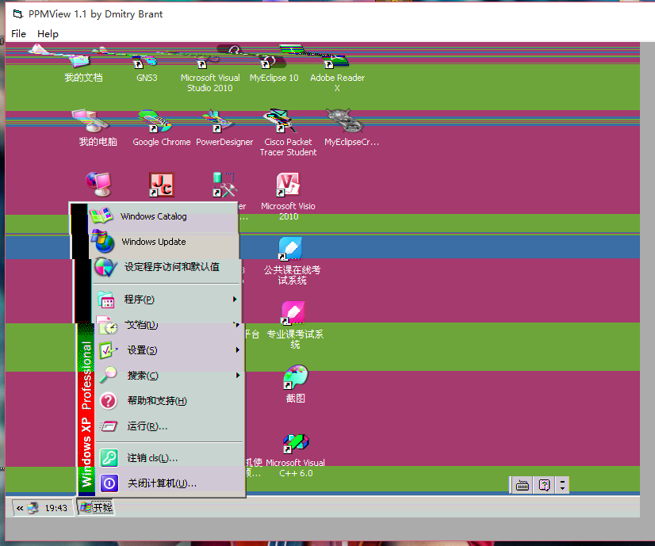

# 笔记

## 2016.03.29

### 传递给spicec的命令行

```batch
D:\green\spice\spicec.exe  -h 10.64.14.8 -p 18009 -s 18010 --ca-file D:/green/spice/spice_truststore.pem --host-subject "C=CN,L=SH,O=Saicocch,CN=Saicocch Server" -w 89fcc1ebaaa7a17b0896662ac14039f4
```

### 使用mingw32编译器

1.安装VMware Player.

2.下载Fedora最新版（Fedora 23）32位映像.

3.安装Fedora后，保证虚拟机的网络为NAT模式，这样Fedora会自动联网.

4.访问[http://mirrors.163.com](http://mirrors.163.com)，下载Fedora的两个repo文件，复制到/etc/yum.repo.d/（需要root权限），随后按照页面上的提示，更新缓存。

5.安装mingw32和gtk支持：
```
$ sudo dnf install mingw32-gcc
$ sudo dnf install mingw32-gtk-2.0
```

6.保证VMware Tools已经安装，这样就可以

- 与主机共享剪贴板
- 在主机与虚拟机间拖放文件

7.在这个地址处复制gtk2的hello world程序：http://www.levien.com/gimp/hello.html

8.在虚拟机内输入：

```
$ gedit hellogtk.c
```

然后按Ctrl+V粘贴代码。

9.输入以下命令编译：

```
$ i686-w64-mingw32-gcc -o hellogtk.exe hellogtk.c $(mingw32-pkg-config --cflags --libs gtk+-2.0)
```

10.打开文件管理器，把hellogtk.exe拖至主机。

11.把该文件放到学宝的spice目录下。

12.测试DLL可用性：

```
E:\XueBao>set path=

E:\XueBao>path
PATH=(null)

E:\XueBao>spice\hellogtk.exe
(成功启动)

E:\XueBao>copy spice\hellogtk.exe

E:\XueBao>hellogtk.exe
(缺少DLL，报错)
```

### 编译spice-gtk

1.去[这个地址](http://www.spice-space.org/download.html)下载：
- spice-gtk-0.31.tar.bz2
- spice-protocol-0.12.11.tar.bz2

2.下载依赖的包：
```
$ sudo dnf install intltool mingw32-openssl mingw32-gstreamer1 mingw32-gstreamer1-plugins-base mingw32-gstreamer1-plugins-good mingw32-usbredir glib2-devel

```

3.编译安装spice-protocol
```
$ mingw32-configure
$ mingw32-make
$ sudo mingw32-make install
```

4.编译spice-gtk
```
$ mingw32-configure --without-sasl --with-audio=gstreamer --with-coroutine=winfiber --disable-smartcard --without-python --enable-usbredir=yes --disable-gtk-doc --disable-werror --enable-static --enable-shared --with-gtk=2.0
$ mingw32-make
```

5.（编译出的spicy程序，放到windows下运行出错。经查，好多文件引用了libobject的DLL两个没有导出的符号：
- g_type_check_instance_is_fundamentally_a
- g_type_class_adjust_private_offset

（后期的猜想是，还是因为有DLL没有提供。找时间再试！）

### 使用官方包

1.后来发现官方是有提供mingw32-spice-gtk包的：

```
$ sudo dnf install mingw32-spice-gtk
```

不过，这个包里的可执行程序不含spicy.exe，只有spicy-screenshot.exe, spicy-stats.exe。

2.打包mingw32目录，放到windows下，解压

3.进入其中的bin目录，执行：

（↓这些是上面的参数。没有提供ca-file和host-subject！）
```
F:\mingw\bin>spicy-screenshot --uri=spice://10.64.14.8?port=18009 -p 18009 -s 18010 -w 89fcc1ebaaa7a17b0896662ac14039f4
wrote screen shot to spicy-screenshot.ppm

```

（↑注意到，上面的命令执行时，学宝的spicec自动退出。可见“独享模式”的含义）

4.可以从[这里](http://www.softpedia.com/get/Multimedia/Graphic/Graphic-Viewers/PPMView.shtml)下载到ppm文件的查看器。

5.打开刚才的截屏，发现还是可以的：



### 必备的DLL
```
iconv.dll
libatk-1.0-0.dll
libbz2-1.dll
libcairo-2.dll
libcelt051-0.dll
libcrypto-10.dll
libexpat-1.dll
libffi-6.dll
libfontconfig-1.dll
libfreetype-6.dll
libgcc_s_sjlj-1.dll
libgdk-win32-2.0-0.dll
libgdk_pixbuf-2.0-0.dll
libgio-2.0-0.dll
libglib-2.0-0.dll
libgmodule-2.0-0.dll
libgobject-2.0-0.dll
libgstapp-1.0-0.dll
libgstaudio-1.0-0.dll
libgstbase-1.0-0.dll
libgstreamer-1.0-0.dll
libgsttag-1.0-0.dll
libgtk-win32-2.0-0.dll
libintl-8.dll
libjpeg-62.dll
libogg-0.dll
libopus-0.dll
libpango-1.0-0.dll
libpangocairo-1.0-0.dll
libpangowin32-1.0-0.dll
libpixman-1-0.dll
libpng16-16.dll
libspice-client-glib-2.0-8.dll
libspice-client-gtk-2.0-4.dll
libssl-10.dll
libvorbis-0.dll
libvorbisfile-3.dll
libwinpthread-1.dll
zlib1.dll
```

## 2016.3.30
- 学宝虚拟机每次重新启动（cold & hot），都会使用新的端口号和密码。
- 能否通过给virt-viewer编写扩展来解决问题？

## 2016.4.7
- 把read_file改成了接受一个FILE \*参数（而不是文件路径），之后读取文件到文本框的的功能失效。后将fopen("r")改成了"rb"，解决了问题。
- 在receiver的实现中，也是使用w而不是wb模式打开的将要写入内容的文件。这导致接收到的文件存盘时，长度莫名增加。而后加上'b'修复了bug。
- 为<code>GtkTextView</code>设置了新的TextBuffer后，会将旧的TextBuffer的引用计数减一。此前如果用<code>gtk_text_view_get_buffer()</code>保存了TextBuffer，该TextBuffer就会失效，因为该函数不会增加TextBuffer的引用计数。因此如果要避免旧的TextBuffer失效，在获取、保存它之后，就要用<code>g_object_ref()</code>增加它的引用计数。

## 2016.4.8
- Windows的文本框有长度限制，超过某个长度后，就无法再增加字符。这会导致大文件（大约25kB左右）传输失败。

## 2016.5.2
我尝试了SPICE协议自带的文件传送功能，传送1M的文件只需2s，效果很好。

问题有两个：
- **Fedora提供的MinGW的spice-gtk包版本太低。**它使用的还是旧版的文件传输，示例程序里文件传输部分的代码是不可用的，因为这个版本根本没有emit信号<code>new-file-transfer</code>。
  - 所以<code>spice.c</code>里面那个显示文件传输进度的对话框是不会显示的。
    - 不过使用<code>spice_main_file_copy_async()</code>的回调函数也能简单监控文件传输的进度。
  - 判断文件传输是否为新版的一种方法是：检查<code>/usr/i686-w64-mingw32/sys-root/mingw/include/spice-client-glib-2.0/</code>中有没有<code>spice-file-transfer.h</code>。
    - 注意：并不是头文件的问题，是spice-gtk库的问题。
  - spice客户端提供文件传输功能的源文件是spice-gtk仓库中<code>channel-main.c</code>。关于文件传输功能的改版，参见[这次commit](https://github.com/SPICE/spice-gtk/commit/2c26ee3c37691f51e1746d9d1004635dd356c28a)。
- **远程机器上的agent程序版本太低。**根本不支持接收文件。必须复制新版agent进去。
  - 远程机器上的vdagent可以在<code>C:\\Program Files\\SaiweiGuestAgent\\vdagent\\</code>目录找到。
  - 可以通过搜索vdagent.exe是否包含<code>%u %s</code>来判断它是否支持文件传送，参见[这次commit](https://cgit.freedesktop.org/spice/win32/vd_agent/commit/?id=71193f658131d31b28b6d9afdd385111bc32377b)。
    - 新版和旧版agent程序“属性”中的版本都是0.5.10.0，所以没办法根据这个确定新旧。
  - agent可以在[官方下载页面](http://www.spice-space.org/download.html)下载。
    - Guest/Windows Binaries
    - 可以用7-zip打开安装程序，从中找出32位的<code>vdservice.exe</code>和<code>vdagent.exe</code>。
  - 只需要替换<code>vdagent.exe</code>即可，该文件压缩后达近240K，传输过去大概需要1个多小时。
  - 替换远程机器上的agent前，先从其任务管理器中结束到两个vd\*进程，然后删除掉<code>vdagent.exe</code>，接下来复制新文件至那个文件夹，最后运行文件夹里的<code>upgrade.bat</code>。
  - 新版的vdagent只比老版本大了34K，能否通过二进制patch，只复制多出来的部分进去，实现替换，从而减少传输量？
